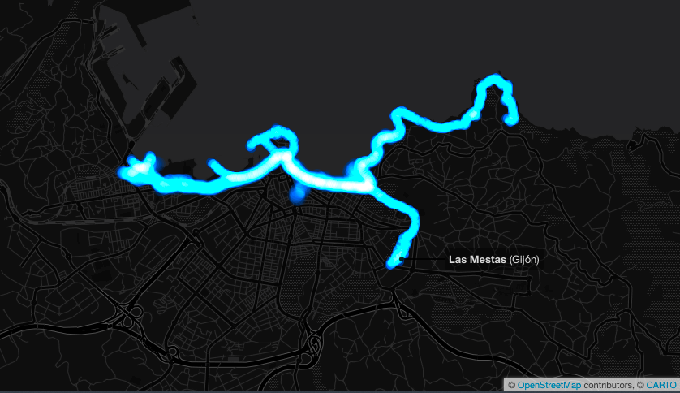
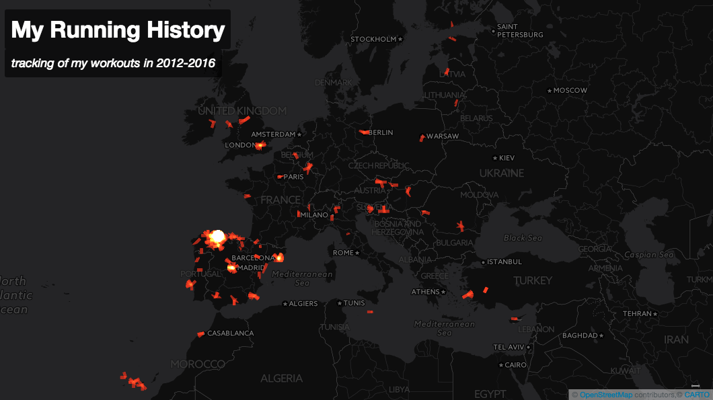

# My Running History Visualization 

[See resulting map](https://espinr.github.io/running/viz.html)

In 2012 I bought a running watch with GPS capabilities. Since then I started logging all my workouts on [Nike+](http://www.nike.com/es/es_es/c/nike-plus). By the way, at that time, they had a really poor web application (i.e., it didn't provide links to share runs or any information regarding altitude, no way to download raw information or accessing it via API…). Later in 2012, Nike+ opened its mind and [launched the Nike+ Accelerator program](http://news.nike.com/news/nike-launches-first-accelerator-program), a new initiative involving third parties to reuse its APIs. Under this program, selected developers could access and reuse data coming from Nike+ APIs to develop innovative products and services. After that, some new applications and integrations with other platforms were created. Good idea, but too selective because **only official Nike+ developers have access to the APIs**. In the meantime, a few enthusiasts such as Matt Stuehler [did a good job](https://mattstuehler.com/lab/NikePlus/) enabling users to download all their workouts as [GPX](http://www.topografix.com/gpx.asp) files. These developers couldn't follow Nike's updates and had to stop their services.

Now I use a TomTom GPS Watch but I still keep my runs synchronized with Nike+. TomTom is much better in terms of compatibility and standards. You can do whatever you want with **your** data. So, in this sense TomTom rocks! 

After seeing some [appealing visualization examples](http://radar.oreilly.com/2011/09/nike-plus-running-data.html) I've tried to represent all my running workouts and races during these years. **More than 16,000 Km** around the world (mostly Europe) shown in just 30 seconds. See [the result](https://espinr.github.io/running/viz.html) focused on my city, where I ran the most.

## How I did it

[SmashRun](http://smashrun.com) is a great web application to analyse massive running data. It has fantastic features for statistics lovers. After linking my Nike+ service with SmashRun I have [an appealing dashboard](http://smashrun.com/espinr) with all my info.

SmashRun keeps the data centralized on their servers, but you cannot access to the raw information yet :-/ 

[Tapiriik](https://tapiriik.com/) is a web service aiming at keeping synchronized third-party fitness platforms. This tool enabled me to save thousands of runs in GPX format from SmashRun to [Dropbox](https://www.dropbox.com/) in seconds. As a result: **586 MBytes in 2.139 GPX files**.

Using [a Python script](https://github.com/espinr/TCX-to-text), all this information was merged into just one large file (53 MBytes) with the minimum information (dates and coordinates) representing thousands of kilometres. 

After that, the file was uploaded to [Carto](https://carto.com) and represented on [the map](https://espinr.carto.com/viz/f9333dd6-cc50-11e6-834e-0e05a8b3e3d7/map).  

See [another example](https://espinr.github.io/running/tracks.html), now with the complete lines with tracks:

